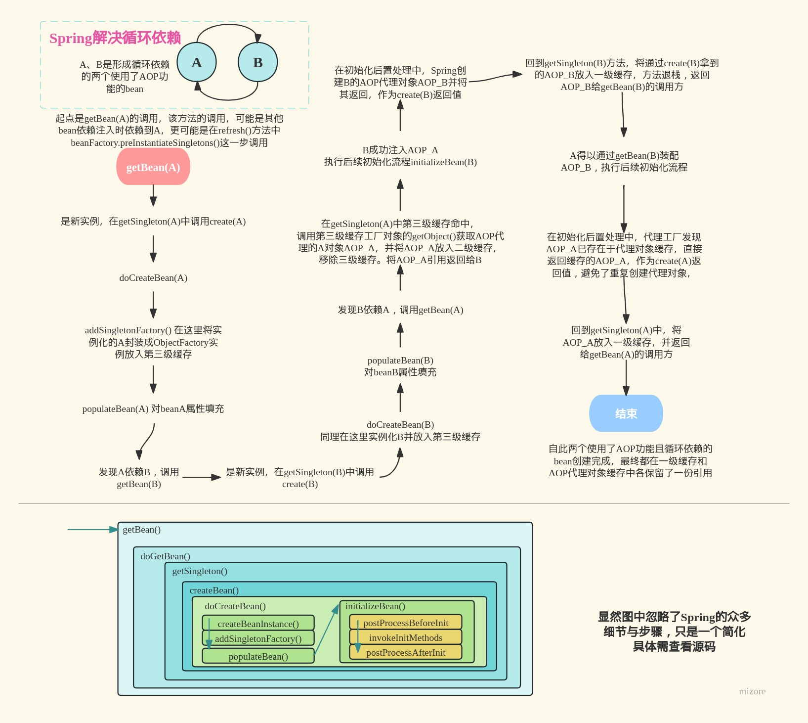

# mzr-spring

为加深理解Spring框架源码而完成的学习性项目，手写简易的Spring框架。

以 https://github.com/fuzhengwei/small-spring 该学习项目为主要参考，感谢。

### step-01
* 实现简易的bean容器，编写bean定义类与bean工厂类。
* 使用`ConcurrentHashMap`作为bean的容器。

### step-02
* `AbstractBeanFactory`类使用**模板设计模式**（定义一个操作中的算法的骨架，而将一些步骤延迟到子类中）。模板方法是`getBean()`，它完成了逻辑骨架，并在其中调用了抽象方法 `createBean()` `getBeanDefinition()`，这些抽象方法延迟到子类实现，但不是由一个子类全部实现，而是由职责不同的两个子类实现，体现单一职责原则。
* 添加单例模块。懒性实例化bean（在`getBean()`中完成bean实例化，即用时再实例化），并将实例化后的bean存在单例缓存容器中一份，在获取bean时优先查单例缓存而无需再次实例化。

### step-03
* 实现含参构造器实例化bean,根据传入的参数粗略寻找匹配的构造器（未比对参数类型，仅根据参数数量来匹配）。
* 采用策略模式，提供jdk反射与cjlib两种方式创建实例。但cjlib创建实例方案在jdk17+无法使用下面是cglib官方给出的说明：

>IMPORTANT NOTE: cglib is unmaintained and does not work well (or possibly at all?) in newer JDKs, particularly JDK17+. If you need to support newer JDKs, we will accept well-tested well-thought-out patches... but you'll probably have better luck migrating to something like ByteBuddy.

因此增加基于`ByteBuddy`的bean实例化策略类`ByteBuddySubClassingInstantiationStrategy`。

### step-04
* 支持bean的属性与依赖注入。
* 在`BeanDefinition`中添加`PropertyValues`属性，表面bean需要注入的属性。
* 在属性注入时，属性分为两种，bean属性与其他属性。前者即当前bean对象依赖其他bean对象。bean属性使用`BeanReference`类型，该类型有一个`beanName`字段，表明了被依赖的bean的name。


### step-05
* 添加资源加载和XML文件解析实现，在`core.io`包下定义资源与资源加载器相关接口与实现类。资源加载器通过资源定位信息参数，返回具体资源。
bean定义读取器依赖资源加载器与注册表，通过加载器拿到资源后，从资源文件中读取bean定义，并通过注册表注册bean定义，放入IoC容器。
在首次获取这个bean时去实例化它，并放入单例缓存Map。
* 接口：`BeanDefinitionReader`、抽象类：`AbstractBeanDefinitionReader`、实现类：`XmlBeanDefinitionReader`，
这三部分内容主要是合理清晰的处理了资源读取后的注册 `Bean` 容器操作。
接口管定义，抽象类处理非接口功能外的注册 `Bean` 组件填充，最终实现类即可只关心具体的业务实现。

### step-06  应用上下文

* 完成`ClassPathXmlApplicationContext`类及其继承体系的编写:
    
  `ClassPathXmlApplicationContext`类接收资源地址，并调用`refresh()`方法完成一系列操作，包括：
  1. bean工厂的创建；
  2. 资源的读取，读取开发者配置的bean定义，加载这些bean定义到上一步创建的bean工厂；
  3. 在Bean实例化之前，执行BeanFactoryPostProcessor的处理方法;
  4. 注册BeanPostProcessor；
  5. 提前实例化一遍`beanDefinitionMap`中定义的bean。
* 定义Spring中两个重要接口`BeanFactoryPostProcessor` 与`BeanPostProcessor`，
它们实现类的处理方法分别在「`Bean` 对象注册后但实例化之前」和「每个`Bean` 对象实例化并属性注入之后，执行初始化方法前后」时执行。
分别体现在`AbstractApplicationContext`类和`AbstractAutowireCapableBeanFactory`类中。


### step-07  bean初始化与销毁方法

1. bean初始化方法在bean实例化并属性注入后被调用。bean销毁方法在虚拟机关闭时调用。
2. 上述两个方法有两种方式声明：
   1. 让注册为bean的类实现`InitializingBean`  `DisposableBean` 接口，实现初始化和销毁方法，这样方法会被框架主动调用（也就是非反射的常规调用方式）。
   2. 在bean类中实现初始化和销毁方法，并在xml配置中指明方法名。这样方法会被框架以反射方式调用。
3. 一种值得一提的分层设计：A类实现B接口、继承C类。B接口定义的方法在C类中实现。
下图中的 `DefaultListableBeanFactory`类，`ConfigurableListableBeanFactory` 接口， `DefaultSingletonBeanRegistry` 类 便是这种关系，实现`destroySingletons()` 方法。维护了各司其职的单一职责原则。


4. **代理模式、装饰模式、适配器模式，傻傻分不清？**

    代理模式与装饰器模式的区别在于：谁持有引用，或者说用户是否持有原对象的引用。
试想大量应用装饰器模式的 Java IO 中的类，被装饰对象由用户持有引用并将其传入装饰器；而在代理模式，代理类目的就是对外屏蔽被代理对象，被代理对象是被代理类持有、使用和增强的。

    两者都是对原对象的增强。

    适配器模式与上面两个模式的区别在于：
    1. 为了达到适配目的，它一定是改变了被适配对象的接口定义的。在装饰器模式中并不强调接口与原对象的一致性，但在代理模式中，代理类是提供与被代理对象完全一致的接口的，让用户就像直接调用原对象一样地调用了代理对象。
    2. 适配器模式只做适配，不做功能增强或改变。目的不同，适配器的目的是适配，它不干扰被适配对象本该提供的功能。手机接口需要的是 Type-c 插头，我耳机是圆孔插头，那转接头（适配器）要做的只是接受圆孔插头， 对外提供 形为 Type-c 的服务，不干涉我耳机的原本功能。这在 Java 编码中体现为适配器类实现 Type-c 接口（定义了用户端需要的规范），实现 `offerTypeC()` 方法，供用户端调用。

    `Spring` 的 `DisposableBeanAdapter` 类是使用了适配器模式的一个例子：

    被适配对象是 `beanDefinition` ，调用方想要只是调用 `destroy()` 就完成「执行 `bean` 销毁方法」的工作。`beanDefinition` 提供的不是`destroy()` 这个接口，而是 `destroyMethodName` ，那么由 `DisposableBeanAdapter` 去做「持有功能提供者，统一对外接口」的工作。

    那么这里为什么不在 `BeanDefinition` 中实现 `destroy()` ，然后调用方去调它的这个方法？

    因为 `Spring` 提供多种 用户定义并指定`bean`销毁方法 的渠道，不止 “配置 `destroyMethodName` ”这一种，还有让 `bean` 类型实现 `DisposableBean` 接口的这种方式。这是不能在框架的调用处写死的，那不如在调用处只是调用 `DisposableBeanAdapter # destroy(Object bean, BeanDefinition beanDefinitio)`，而不必关心更多细节。
    
    这里的“调用处”，即供给 「注册的虚拟机关闭时的钩子函数」 的线程任务。

### step-08    Aware感知

赋予bean获取所属`BeanFactory,` `BeanClassLoader`, `ApplicationContext`, `BeanName` 的能力，只需要让 bean 实现对应的 `Aware` 接口即可。
具体做法如下：
1. 定义了`BeanFactoryAware,` `BeanClassLoaderAware`, `ApplicationContextAware`, `BeanNameAware` 四个接口，定义 `setXXX()` 方法。
在bean初始化时（更具体一点就是在执行bean后置处理器的beforeInitialization方法之前），判断bean是否继承了上述接口，如果是，框架调用上述接口定义的 `set`
方法，通过把需要的框架对象（bean所属的`BeanFactory,` `BeanClassLoader``BeanName`）传参的方式，让bean可以持有和使用这些对象。
2. bean所属`ApplicationContext` 的获取相对特殊，使用了一个继承 `BeanPostProcessor` 的 `ApplicationContextAwareProcessor`，它在 `postProcessBeforeInitialization()`
方法对实现`ApplicationContextAware`接口的bean进行所属应用上下文对象的注入。那这个bean后置处理器是怎么拿到应用上下文对象的呢？在 `AbstractApplicationContext`执行 `refresh()` 方法中，
创建了这个bean后置处理器，并在构造时给它提供了自身这个应用上下文对象。


**现在可以相对完整地说一下Bean的生命周期了：**
1. 以配置文件或注解的方式声明 `bean`；
2. 读取配置文件或注解，创建对应的 `beanDefinition`；
3. 注册 `bean` ,实际上是注册对应的 `beanDefinition` ，将 `beanDefinition` 放入一个 `map` 容器中；
4. 执行 `BeanFactoryPostProcessor` 的处理方法操作已注册的 `beanDefinition`；
5. 实例化 `bean`；
6. 为 `bean` 填充属性（属性信息是存储在 `beanDefinition` 中的，另外，如果需要填充的属性是 bean引用 ， 那么先去执行这个新 bean 的创建工作（实例化、属性填充、感知、初始化、初始化前后处理方法））；
7. `Aware` 感知，即上文所说，使实现特定 `Aware` 接口的 `bean` 获取到 特定的框架对象。
8. 在调用 `bean` 自定义的初始化方法之前，先执行每个 `BeanPostProcessor` 的 `postProcessBeforeInitialization()` 方法；
9. 调用 `bean` 自定义的初始化方法;
10. 在调用 `bean` 自定义的初始化方法之后，执行每个 `BeanPostProcessor` 的 `postProcessAfterInitialization()` 方法；
11. 注册实现了 `DisposableBean` 接口的 `bean` （实际上是使用 `DisposableBeanAdapter` 适配器包装 `bean` 并存入一个「一次性beanMap」容器中）；
12. 如果定义的是单例 `bean` （默认单例），则将实例放入单例`bean`缓存（实际是一个`map`，下次取用时直接从`map`中取到`bean`实例而非再次创建实例）。
13. 使用 `bean`；
14. 调用自定义的 `bean` 销毁方法，这发生在虚拟机关闭时的钩子函数中。

另外，非单例bean是进行第11步的，具体贴一段GPT：

>在Spring框架中，默认情况下，单例作用域的Bean在容器关闭时会执行自定义的销毁方法，但非单例作用域的Bean并不会执行销毁方法。
<br>这是因为Spring容器对于单例Bean和非单例Bean的生命周期管理方式不同。对于单例Bean，Spring容器负责创建、初始化和销毁它们，可以确保在容器关闭时调用销毁方法，以释放资源或执行清理操作。因此，单例Bean的销毁方法会被调用。
<br>而对于非单例Bean，Spring容器在创建时将其交给应用程序管理，容器不负责跟踪和销毁这些Bean。这是因为非单例Bean可能具有更多的复杂性和特定的生命周期需求，例如原型作用域的Bean可能每次获取都需要创建新的实例。因此，Spring容器不会自动调用非单例Bean的销毁方法。
<br>如果你需要在非单例Bean销毁时执行自定义的清理逻辑，你可以手动在Bean中实现DisposableBean接口或使用@PreDestroy注解来定义销毁方法。然后，在应用程序中，在不再需要非单例Bean时，显式地调用销毁方法。例如，可以通过使用ConfigurableBeanFactory的destroyBean()方法来销毁非单例Bean。

```
@Autowired
private ConfigurableBeanFactory beanFactory;

// 销毁非单例Bean
beanFactory.destroyBean(nonSingletonBean);
```
> 总结起来，非单例Bean不执行自定义的销毁方法是因为Spring容器不负责跟踪和销毁这些Bean，但你可以手动在适当的时候调用销毁方法来执行清理操作。


### step-09 FactoryBean

不是`BeanFactory`吗？`FactoryBean`是什么？

`FactoryBean`是`Spring`框架供开发人员实现的一个接口，如果一个`bean`实现了这个接口并重写其规定的方法，那么这个`bean`就拥有了自行创建其他`bean`对象的能力。

`FactoryBean`将创建`bean`实例的权力下放给开发人员，为`Spring`框架提供了更高的灵活性与扩展性。开发人员通过实现接口的`getObject()` `isSingleton()`方法，自行决定要创建的实例类型，是否是单例模式，如何创建。

`FactoryBean`也是一个`bean`,会被`ioc`容器创建与持有，但在获取这个`bean`的时候，`Spring`框架返回的不是这个`bean`实例，而是它的`getObject()`方法所创建的对象。

那么`getObject()`方法所创建的对象究竟算不算`bean`对象呢？算的，它的特殊之处在于，它的创建不是`ioc`管理的，而是由框架的使用者编写如何创建，但此后它可以被当作
bean对待，原因其实上面讲过了，就是它会在任意尝试获取它的创造者FactoryBean时被得到，这一点体现在 `AbstractBeanFactory#getObjectForBeanInstance` 方法中。

另外一提，这些由 `FactoryBean` 创建的`bean`实例，如果是单例，那会被缓存在单独一个单例缓存`map`中，具体见 `FactoryBeanRegistrySupport` 这个类。


### step-10 容器事件定义、发布、广播与监听

`Spring` 的事件功能模块基于观察者模式也叫发布订阅模式，由事件、发布者、广播器、监听者这几部分组成来实现应用事件发布监听的功能。

#### 事件定义：

编写事件类并继承 `ApplicationContextEvent`，`Spring` 已经定义好了 `ContextRefreshEvent` `ApplicationEventMulticaster` 等事件。
在特定事件发生时对应的事件对象会被创建并被发布者广播给监听者。

#### 事件发布：

实现 `ApplicationEventPublisher` 接口，当前类则拥有发布事件的功能，充当某个或某些事件的发布者，如抽象应用上下文类实现了这个接口：
    
  * 在 `refresh()` 方法中发布容器刷新事件；
  * 在容器关闭时由钩子函数调用的 `close()` 方法中发布容器关闭事件；
  * 我们也可以获取应用上下文，调用发布方法发布自定义的事件。

发布的实现需要**应用事件广播器**的支持。

#### 事件广播：

事件广播器是事件发布者所依赖的组件，发布者通过调用广播器的广播方法，将指定事件传达给对该事件感兴趣的、注册在广播器的监听者们。

由上，广播器主要起到注册监听者与执行事件传达的作用。

注册监听者： 实际上是将 `ioc` 中的所有实现了 `ApplicationListener` 的`bean`对象加入到由广播器持有的一个监听者集合。

执行事件传达： 在监听者集合中遍历查找对指定事件感兴趣的监听者（何为感兴趣？见下文），调用它们的 `onApplicationEvent(E event)` 方法。

抽象应用上下文类便是在 `refresh()` 方法中做了初始化广播器并注册监听者到广播器的工作。这是需要事件发布者做的，发布事件所必要的工作。

#### 事件监听：

想让编写的类型成为某个事件的监听者，需要该类型实现 `ApplicationListener<E extends ApplicationEvent>` 接口，在泛型部分指定感兴趣的事件（也就是要监听的事件）。
并注册为 `bean` （ `xml` 或注解）， 这样才能由 `ioc` 将这个监听者注册到广播器中（体现在上面所说的 `refresh()`方法）。

实现上述接口后需要实现接口定义的 `onApplicationEvent(E event)` 方法， 这个方法表明了 **当监听者被通知到感兴趣的事件发生了时该做些什么动作**。 由广播器负责调用，这一点上文有说。

#### 定义事件与监听者，在时机来临时获取应用上下文对象调用发布事件方法——这是Spring使用者对其事件功能的基本使用。

### step-11 基于Jdk动态代理的AOP

面向切面编程，是并列于 PP 、 OOP 的一种编程思想。软件开发需要解决业务需求与系统需求，当 OOP 被很好地用来解决业务需求时，一些系统需求仍难以对付——
比如统计方法耗时、日志监控、接口幂等性处理等，它们需要在程序的某些节点（ `JoinPoint` ）处执行，但如果在每处调用这些横切逻辑会带来系统需求对业务需求
的代码侵入，方法臃肿维护困难。AOP 是来解决这种问题的， 它在不同于 OOP 的维度上，通过引入切面 `Aspect` ，解耦横切逻辑与业务代码。尽管目前很多 AOP 的实现寄生于 OOP 之下（用 class 那套语法编写 AOP Aspect）。

AOP有两种实现方案： 静态AOP与动态AOP。区别在于横切逻辑织入系统是在编译时还是运行时。

Java实现AOP采用的是动态的方式，具体也分两种实现： 动态代理和动态字节码增强。前者要求被代理类型实现接口，动态代理为接口生成织入横切逻辑的代理类实例；
后者在运行时生成被代理类型的子类 `.class` 文件，将横切逻辑写进子类。

SpringAOP 是一个基于Java的 AOP 框架，采用Jdk动态代理与Cglib字节码增强技术相结合的方式实现功能。

SpringAOP的做法大致是： 将目标对象、切入点表达式、方法拦截器封装到 `advised` 交给Jdk/Cglib代理工厂类，代理工厂类用于生成被织入横切逻辑的代理对象： 
根据 切入点表达式`Pointcut` 匹配需要织入横切逻辑的连接点 `JoinPoint`， 对于匹配的连接点使用反射调用 执行用户编写在方法拦截器的横切逻辑，不匹配则正常调用。

### step-12 把 AOP 扩展到bean的生命周期

在 `AbstractAutowireCapableBeanFactory#createBean`方法中，原本是直接调 `doCreateBean()` 去做策略实例化、属性注入、aware注入、施加beanPost处理、调用初始化方法
这一系列动作的；现在是在调 `doCreateBean()` 之前，先调用 `resolveBeanBeforeInstantiation()` ，这个方法作用是，在以往实例化之前，调实现了 `InstantiationAwareBeanPostProcessor`
接口的bean后处理器的实例化前置处理方法 `postProcessBeforeInstantiation()`，如果bean是使用aop功能的bean，那么该方法代替 `doCreateBean`完成实例化和应用beanPostProcessors实例化后置处理的动作，
但得到的实例化对象是织入aop横切逻辑的Jdk/Cglib代理对象。

目前的实现方法有缺陷——使用aop功能的bean（也就是目标JoinPoint所在的bean）绕过了 `doCreateBean`，那也就没有去做属性注入、aware注入、施加beanPost初始化前置处理、调用初始化方法，
失去了这些功能。下面两图是 `OrderService` 使用aop前后的对比结果：

不使用，aop为 `OrderService` 注入 `UserService`，并打印 `OrderService#getUserService` ：


使用aop后，注入失败，打印结果为 `null` ：


可以 `resolveBeanBeforeInstantiation()` 方法的实例化让bean失去了依赖注入等功能。

### step-13 包扫描Component注解与beanFactoryPost处理占位符

#### beanFactoryPost处理占位符

处理占位符是用了一个beanFactory后置处理器 `PropertyPlaceHolderConfigurer`，作用是：
在所有`BeanDefinition`加载完成后，实例化bean对象之前，修改 `BeanDefinition`： 处理占位符——用配置文件的属性替换掉占位符表示的字符串值。所以这个beanFactory
后置处理器需要能加载指定的属性配置文件，并为`beanDefinition`的符合占位符要求的`propertyValue`的值进行替换。

#### 包扫描Component注解注册为bean

使用`hutool`提供的`ClassUtil`工具类做 在 `xml`文件配置的扫描包路径下扫描加了指定注解的 `class`，由此得到加了`@Component`注解的类，
为这些类创建对应的`beanDefinition`，放入`beanDefinition`的注册器。这一步并没有做为每个`beanDefinition`填充好属性。

综上，做到这里，如果为加了自定义注解`@Component`的类写属性`String token = "${token}"`，占位符替换是不会生效的——因为占位符处理器处理的是定义在`beanDefinition`的
`private PropertyValues propertyValues` 这里的属性，而目前通过注解定义bean的方式，在创建对应的`beanDefinition`后没有做 `PropertyValues` 的填充工作。这是下一步要完善的。

### step-14 基于注解的bean的字段注入

上一步说到，使用注解注册的bean没有属性填充，那么在这一步就实现了基于注解的依赖注入。

#### 注解

主体是这三个注解： `@Autowired` `@Qualifier` `@Value`

下面先分别介绍下作用：

`@Value`:

要注入的依赖分为值类型与引用类型，该注解解决的是值的注入，底层依赖于字符串值解析器，支持自定义的值解析规则。只要编写 `StringValueResolver`接口的实现类，就能自定义对 `@Value`
值的解析，可以定义自己的值注入与解析规则。比如内部类 `PlaceholderResolvingStringValueResolver` 是在指定属性配置文件中匹配 `${}` 格式的占位符所表示的属性。
可以有多个字符串值解析器去解析这个注解的值，Spring在处理这个注解时，会遍历这些字符串解析器的解析方法 `String resolveStringValue(String s)`。当然，也可以直接使用字面值，而不走一些特殊的解析规则，不过这样意义不大了。

<br>

`@Autowired`： 

很常用的Spring注解，用来解决为bean定义字段的引用依赖。依赖的对象一定是ioc中的其他bean。该注解优先根据类型去获取依赖对象，当ioc中该类型有多个bean时，
会按照所加在的字段的字段名来匹配苯二胺那么与之一致的bean。

常与 `@Qualifier`、 `@Primary` 配合使用，前者下面会说，先说下后者： 还是当ioc中该类型有多个bean时，优先装配带有 `@Primary` 注解的bean。

也经常用来与 `@Resource` 注解比较，`@Resource`是J2EE提供的，`@Autowired`是Spring提供的，但两者Spring都是支持的。另外`@Resource`默认按name
匹配，但也支持设置注解属性来让它按类型匹配。我觉得在「优先按什么匹配」这个方面比较这两个注解没有意义，甚至不太值得去刻意记。反而 `@Autowired` 可以通过
 `required` 属性设置非必要依赖这点更值得一提（这两个注解默认都是必要依赖，也就是依赖找不到会抛异常或报error，都会让项目启动失败）。
 **`@Autowired` 比  `@Resource` 多支持了非必要依赖**，区别注意这点就够了。
<br>

`@Qualifier`：

与 `@Autowired` 配合使用，`@Qualifier` 会指定一个beanName，当ioc中依赖类型有多个bean时，优先按照`@Qualifier`指定的beanName来装配。

#### 实现

基于注解依赖注入的实现主要靠 `AutoWiredAnnotationBeanPostProcess` 核心方法是 `postProcessPropertyValues()` ,这个方法由 `InstantiationAwareBeanPostProcessor`
接口定义，发挥作用的时机是每个bean实例化后且属性填充前，提供了对「尚未填充属性的bean实例」的操作支持。`AutoWiredAnnotationBeanPostProcess` 的
做法就是在`postProcessPropertyValues()`方法中扫描bean字段上的目标注解并做相应的依赖注入的处理。

`InstantiationAwareBeanPostProcessor`这个接口值得一提，它继承了`BeanPostProcessor`，却总在特殊的时间点发挥作用——`BeanPostProcessor`
通常在每个bean的初始化前后调用处理方法，但`InstantiationAwareBeanPostProcessor`接口打破了这一规定，它能在bean实例化前基于注解实例化bean，也能在bean填充属性前基于
注解为bean注入依赖。可以发现，它的特殊性都与注解离不开关系，而注解是Java在1.5才引入的，所以我猜想这个特殊性的引入，是Spring为了支持注解（jdk1.5才引入）的被迫之举。

### step-15 给代理对象设置属性注入

这一步解决了**step-12**所说的问题——aop代理对象没有走`doCreateBean()`流程导致的一些功能缺失，具体解决做法是将 `DefaultAdvisorAutoProxyCreator`
类中创建对象的工作从 `postProcessBeforeInstantiation()` 方法迁移到了 `postProcessAfterInitialization()` 方法。

由于前者方法是在bean实例化之前操作对应的bean定义，是通过反射创建一个全新的目标对象并生成其代理对象返回，由此结束了 `AbstractAutowireCapableBeanFactory#createBean()` 方法
。**step-12**中也说了，这么做会避开一些bean生命周期的必要步骤，所以改为在`postProcessAfterInitialization()` 方法，基于经过`doCreateBean()`方法实例化初始化后的bean对象，
去生成它的代理对象并返回，这样代理对象相当于做了此前确实的步骤。

之前是这样生成目标对象的：

```java
        TargetSource targetSource = null;
        try {
            targetSource = new TargetSource(beanClass.getDeclaredConstructor().newInstance());
        } catch (Exception e) {
            e.printStackTrace();
        }
```

现在改为了用完成初始化之后的bean对象，作为代理的目标对象：

```java
    @Override
    public Object postProcessAfterInitialization(Object bean, String beanName) throws BeansException {
        // ......
        // 由反射创建新对象，改为了基于传来的初始化完成之后的bean对象，来创建它的代理对象
        TargetSource targetSource = new TargetSource(bean);
        // ......
    }
```

### step-16 三级缓存解决循环依赖

看到这四个字大概都能理解了，bean的依赖关系形成环，这包括一个bean的自身依赖与多个bean参与的环形依赖，那么这些bean构成了循环依赖。

自己想一下解决方法也很好想到，首先依赖注入不能是通过构造器注入（构造器注入使bean的实例化与依赖注入合并成了原子操作），想解决循环依赖必须承认一种
「已实例化但尚未完成依赖注入」这样的一种bean状态，这里把这样的bean称为半成品bean，半成品bean可以被注入到依赖它的其他bean中。

于是每当bean实例化后就将其放入一个半成品bean容器作为缓存，之后再进行依赖注入，保证有其他bean依赖它的话能从半成品bean缓存中拿到目标bean的引用。

这样的一个一级缓存可以解决简单场景下的循环依赖。

Spring采用的是三级缓存的做法，在 `DefaultSingletonBeanRegistry` 中分别创建成品bean容器、半成品bean容器、工厂对象容器：

```java
    // 一级缓存 存放成品bean实例
    private final Map<String, Object> singletonObjects = new ConcurrentHashMap<>(256);

    // 二级缓存，存放半成品bean实例，也就是bean实例化后但尚未填充属性
    private final Map<String, Object> earlySingletonObjects = new ConcurrentHashMap<>(16);

    // 三级缓存，存放ObjectFactory类型工厂对象
    private final Map<String, ObjectFactory<?>> singletonFactories = new HashMap<>(16);
```

设三级缓存而非一级主要是应对Spring框架的复杂性、bean对象类型多样性。

* `createBean()` 的结果放入一级缓存，这是我们最终要用到的bean。

* 而二级缓存存放实例化后尚未创建完成的bean，二级缓存的设置区别了成品bean与半成品bean，bean创建完成后放入一级缓存并及时从二级缓存中移除，避免了可能的空指针隐患

* 第三级缓存的设置是出于代理对象的考虑，在Spring中，有时我们真正需要的是代理对象而非原生bean对象，比如AOP功能的代理对象。
第三级缓存存放的值是 `ObjectFactory<?>` 类型的对象，实际上这是一个函数式接口，接口方法是`T getObject()`，所以不如理解为第三级缓存存放的是 `beanName`以及对应 `beanObject` 的创建逻辑。
对于使用了AOP的bean， `getObject()` 方法获取到对应bean的aop代理对象。每次三级缓存工厂对象的 `getObject()`的调用，都会将获取的对象放入二级缓存—— 这是我们真正需要用到的对象。

在 `createBean()` 结束后，该方法返回的代理对象引用会存入一级缓存，同时移除二三级缓存，这发生在`DefaultSingletonBeanRegistry#getSingleton(String beanName, ObjectFactory<?> singletonFactory)`。

第三级缓存的这种设计保证了在尝试获取bean对象时拿到的是我们真正需要的bean对象，比如我们需要AOP增强的代理对象，而非原生bean对象。

举例说明一下Spring解决循环依赖的流程，并且是使用了AOP代理的情形：




